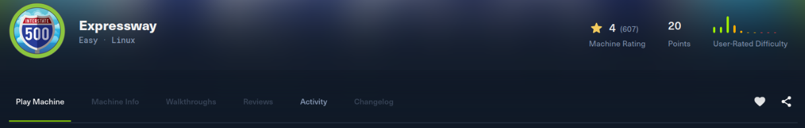
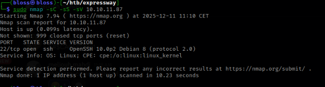
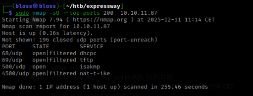
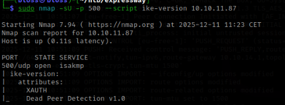
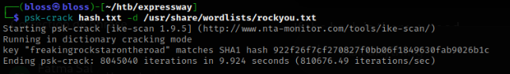

# Expressway -  Machine Walkthrough

## Initial Enumeration

I started with a simple Nmap scan to discover open services on the target machine , the scan revealed only an ssh port ? , ssh dosnt have default creds or anything like that , so I scanned for udp ports 

the only udp port that wasnt filetered was 500 Nice — UDP/500 (ISAKMP) is interesting,that means the target is running IPsec VPN / IKE.
To get more info about it, use Nmap scripts, because ISAKMP speaks an IKE protocol that Nmap can interrogate.

from this point I read some articles trying to understand how the protocol works and how can i possibly interrogate the port 

this article was interesting : https://angelica.gitbook.io/hacktricks/network-services-pentesting/ipsec-ike-vpn-pentesting 

I got a hint from a friend atp , (shoutount mahdi) to get a passwd and a username  ![nmap udp 500 ] from the following info (../assets/images/expressway/500.2.png) , a cookie , and some info about the ocnfiguration of the protocol 

I use psa-crack to get the password for the username ike@expressway.htb 

## User flag 
 
using the found creds i logged into ik account and found the user flag 

## Root flag 

For the privelage excalation , i found an already existing cve on the machine :( , i ran it and i got root

the flag was at /root

