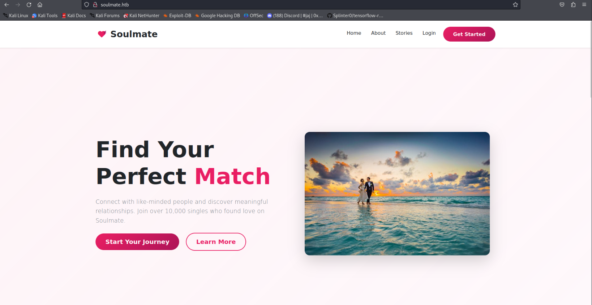
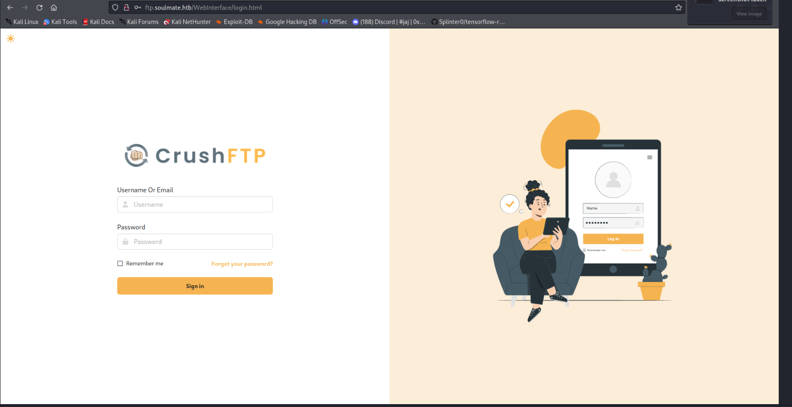
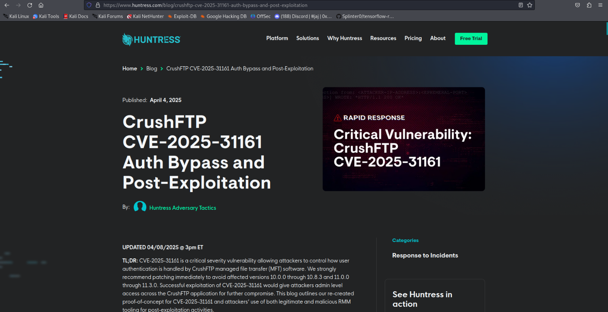
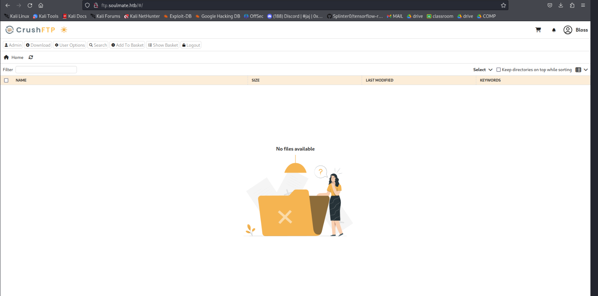
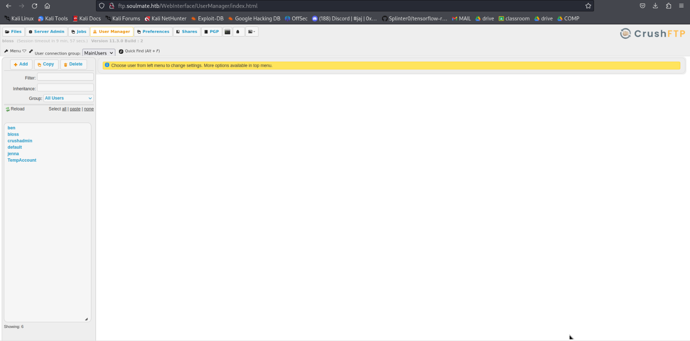
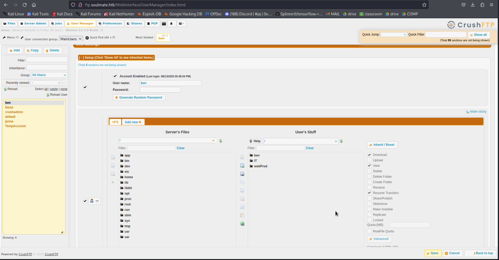
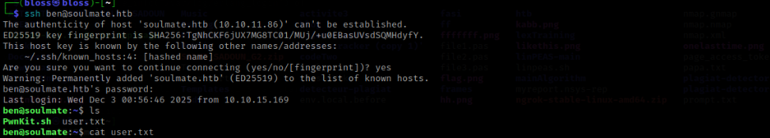

# Soulmate -  Machine Walkthrough
## Initial Enumeration

```bash
sudo nmap -sC -sV -oA nmap 10.10.11.86
[sudo] password for bloss: 
Starting Nmap 7.94 ( https://nmap.org ) at 2025-10-21 11:32 CET
Nmap scan report for 10.10.11.86
Host is up (0.14s latency).
Not shown: 998 closed tcp ports (reset)
PORT   STATE SERVICE VERSION
22/tcp open  ssh     OpenSSH 8.9p1 Ubuntu 3ubuntu0.13 (Ubuntu Linux; protocol 2.0)
| ssh-hostkey: 
|   256 3e:ea:45:4b:c5:d1:6d:6f:e2:d4:d1:3b:0a:3d:a9:4f (ECDSA)
|_  256 64:cc:75:de:4a:e6:a5:b4:73:eb:3f:1b:cf:b4:e3:94 (ED25519)
80/tcp open  http    nginx 1.18.0 (Ubuntu)
|_http-server-header: nginx/1.18.0 (Ubuntu)
|_http-title: Did not follow redirect to http://soulmate.htb/
Service Info: OS: Linux; CPE: cpe:/o:linux:linux_kernel

Service detection performed. Please report any incorrect results at https://nmap.org/submit/ .
Nmap done: 1 IP address (1 host up) scanned in 48.88 seconds
```
The scan revealed an http and an ssh , i added the address to my /etc/hosts 
and went over to check what it exposes 



so , its basicaly a dating web wesbite  , i looked around for versions , created and account and logged in , but nothing was interesting , I ran a ffuf brute-force for subdomains meanwhile i looked into other vulernabilities 


I added ftp.soulmate.htb to my /etc/hosts and looked it up on the browser , i was redirected to the following : 



i tried logging in .. looked up crushFTP creds online but nothing , so i thought there might be a cve somewhere  , ctrl u to see the code and there it was : 

googled a cve : 
https://github.com/Immersive-Labs-Sec/CVE-2025-31161
 
a 9.8 CVSS critical severity vulnerability  that allows an attacker to completely bypass authentication by abusing the way the server processes S3-style Authorization headers. When a request includes a header like Authorization: AWS4-HMAC-SHA256 Credential=username/, CrushFTP extracts the username but—due to a flawed design—automatically sets a flag (anyPass) that tells the authentication system to accept the login without checking any password. Because the signature is never validated and the cookie only needs to follow a simple format (not be legitimate), an attacker can authenticate as any existing user, including administrators, just by sending a crafted header with their username. This leads to full remote compromise of the CrushFTP server.


and so i logged in with the new creds i created 



after lurking around for a bit , there appears to be a user management functionnality that allows you 
to change multiple users' passwords , including ben's so i did then and logged in using his account





Ben can upload files in webProd , so i uploaded a webshell i found at  : https://raw.githubusercontent.com/pentestmonkey/php-reverse-shell/refs/heads/master/php-reverse-shell.php


and  set up a listener at 1234 


i opened an http server on my machine , got linpeas.sh and transfered it over to the target machine then ran it for a full scan


After searching, I found this strange file that was running as root:


i checked it out and found creds  to an ssh!! yay


so i logged in using those creds and got my user flag 



